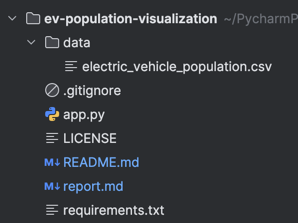

# Washington State EV Analytics Platform

### Data Source:
[Washington State Electric Vehicle Population Data](https://data.wa.gov/Transportation/Electric-Vehicle-Population-Data/f6w7-q2d2/about_data)

This is an interactive data visualization platform for exploring Washington State's electric vehicle data, built with Streamlit and Altair for CSCA 5702 - Fundamentals of Data Visualization.

## Features


### Interactive Analytics Dashboard
- **11 Different Analysis Pages** covering market trends, pricing, maps, and performance
- **Smart Filtering** with live updates for years, prices, car brands, types, and locations
- **Click-to-Filter Charts** - click anywhere on a chart to filter everything else
- **Modern Design** with gradients, animations, and clean styling

### Key Visualizations
- Executive Dashboard with key metrics and interactive filtering
- Price Analytics showing cost trends and efficiency
- Geographic Insights with location-based patterns
- Market Leaders showing brand competition
- Performance Analytics tracking range and technology changes
- Statistical charts, market shares, and correlation heatmaps

## Technologies Used

- **Streamlit** - Web app framework (makes it easy to build data apps)
- **Altair** - Chart library (creates beautiful interactive visualizations)
- **Pandas** - Data handling (reads and processes the CSV data)
- **NumPy** - Math operations

## Project Structure


## Getting Started

### Prerequisites
- Python 3.8 or higher
- pip (comes with Python)

### Installation

1. **Clone the repository**
```bash
   git clone https://github.com/sanctusgee/csca5702-dataviz-final.git
   cd csca5702-dataviz-final
```
2. **Install dependencies**
```bash
   pip install -r requirements.txt
``` 

3. **Run the application**
```bash
streamlit run app.py
```
4. **Open your browser** to http://localhost:8501

You can also check out the live version at: [CSCA 5702 Final Project](https://csca5702-final-project.streamlit.app/)

### Usage

**Navigation**
Use the dropdown menu in the sidebar to switch between pages:

- **Home**: Overview and main stats
- **Executive Dashboard**: Key metrics with click-to-filter charts
- **Price Analytics**: Cost trends and value analysis
- **Geographic Insights**: Where EVs are popular
- **Market Leaders**: Top brands and competition

**Interactive Features**

- Click on any chart to filter all the others
- Use sidebar controls to narrow down by year, price, brand, type, or location
- Select areas in scatter plots to zoom into specific segments
- Hit reset buttons to clear your filters

**Sample Mode**
The app automatically shows 5,000 data points for smooth performance while keeping the insights accurate. You can toggle this in the sidebar if needed.

---
### Project Highlights

**Data Source**
This project uses official data from [Washington State's Department of Licensing](https://data.wa.gov/Transportation/Electric-Vehicle-Population-Data/f6w7-q2d2/about_data):
- **What's included**: 150,000+ records of electric and hybrid vehicles
- **Data points**: Car make/model, electric range, prices, locations, registration dates

**Course Information**

- CSCA 5702 - Fundamentals of Data Visualization
- University of Colorado Boulder

**License**

This project uses the MIT License - see the LICENSE file for details.

**Contributing**

This is a school project, but I'd love feedback! Feel free to open an issue or suggest improvements.