# Final Project Report: Washington State EV Analytics Platform

---

## Data Source and Project Overview

**Data Source:** https://data.wa.gov/Transportation/Electric-Vehicle-Population-Data/f6w7-q2d2/about_data

**GitHub Repository:** https://github.com/sanctusgee/csca5702-dataviz-final

**Live Application:** https://csca5702-final-project.streamlit.app/

### Data Characteristics and Design Implications

The dataset has 150,000+ electric vehicle registrations from Washington State's Department of Licensing, covering everything from vehicle make/model and model year to electric range, MSRP, geographic location (county/city), and vehicle type (Battery Electric vs. Plug-in Hybrid). 

This data structure drove three major design decisions: **First**, dealing with 150K records meant I had to get smart about performance optimization through sampling to keep things responsive. **Second**, the multi-dimensional nature (geographic, temporal, performance, price) made it clear that cramming everything into one dashboard would be overwhelming - better to create focused analysis pages. **Third**, mixing categorical data (make, county) with continuous variables (price, range) shaped my visualization choices - scatter plots work great for price vs. range relationships, bar charts handle categorical comparisons well, and time series reveal trends over years.

### Goals and Tasks

My main goal was taking this massive government dataset and turning it into something actually useful for three different types of people: **policy makers** who need quick adoption trend insights, **automotive dealers** analyzing market competition, and **potential EV buyers** trying to understand the landscape. 

These user needs shaped how I organized everything: high-level overview capabilities (Executive Dashboard), specialized deep-dives (Price Analytics, Geographic Insights), and comparison tools (Market Leaders, Performance Analysis). Each task needs a different mental approach - overview for spotting patterns, filtering for exploration, and detail-on-demand for specific insights.

---

## Visualization Implementation

### Screenshots and Platform Access

**Note:** Screenshots of all eleven visualization pages are included below, showing the complete range of analytical capabilities from the navigation dropdown menu.

**Live Platform Access:** The fully interactive application is deployed at https://csca5702-final-project.streamlit.app/ where you can explore all features with real data.

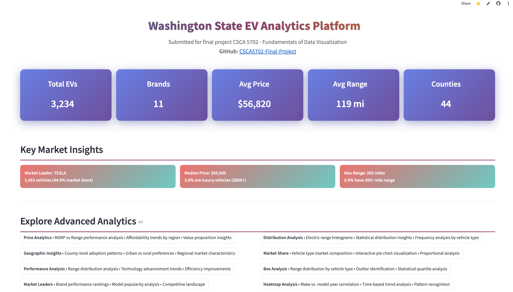
Home page - landing and navigation overview

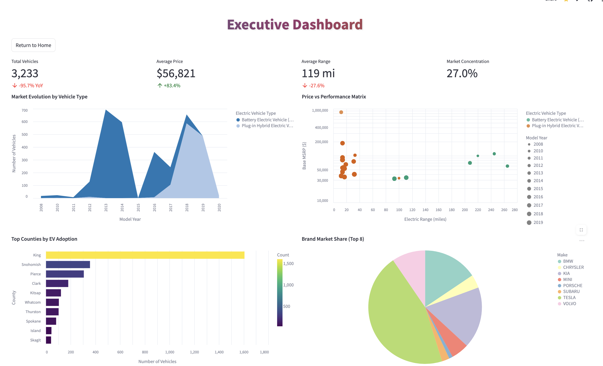
Screenshot of the Executive Dashboard with cross-filtering capabilities

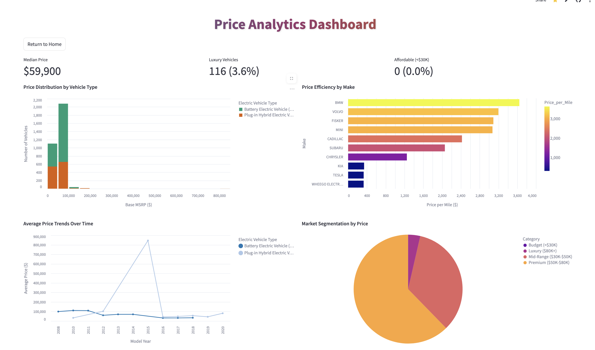
Screenshot of the Price Analytics page

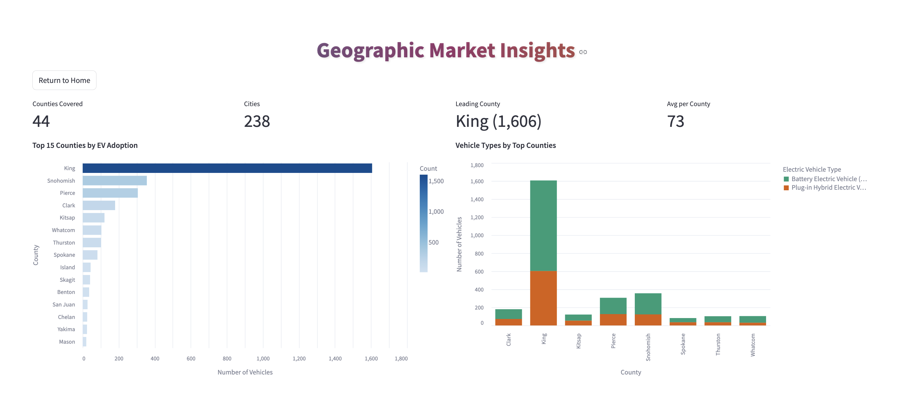
Screenshot of the Geographic Insights page

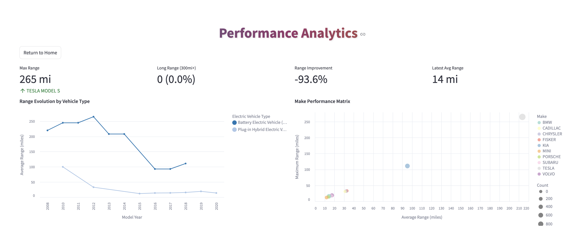
Screenshot of the Performance Analysis page

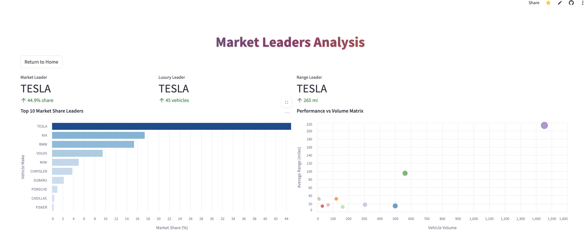
Screenshot of the Market Leaders page

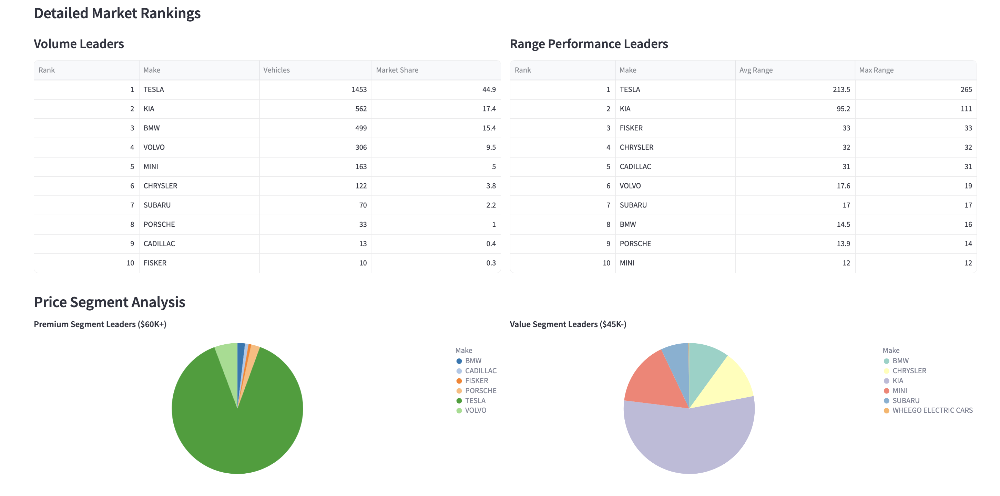
Screenshot of the Market Leaders page (continued)

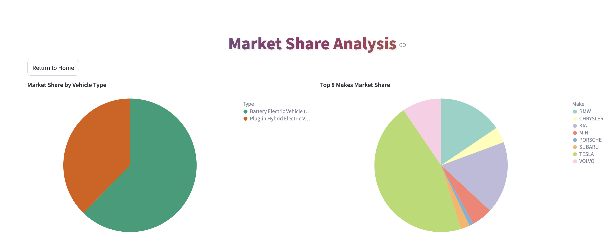
Screenshot of the Market Share page

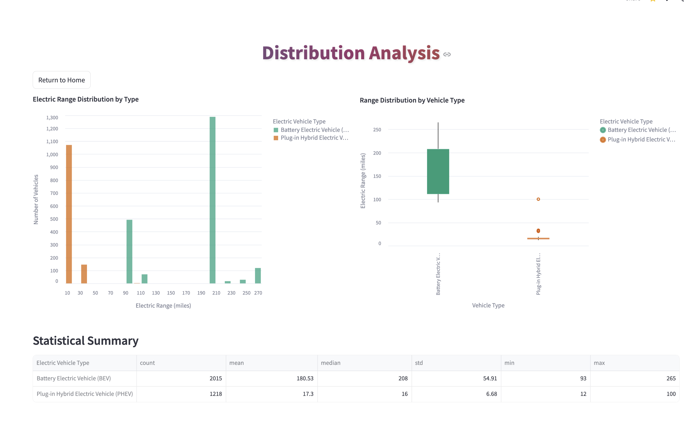
Screenshot of the Distribution Analysis page

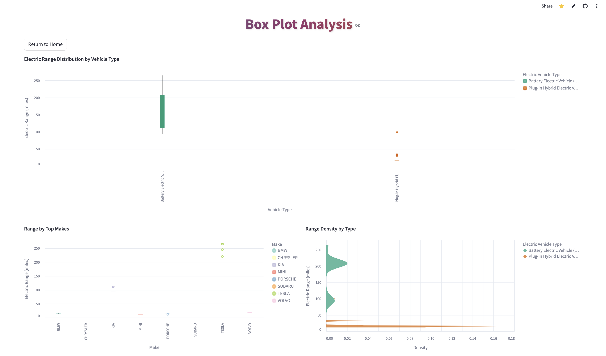
Screenshot of the Box Plot Analysis page

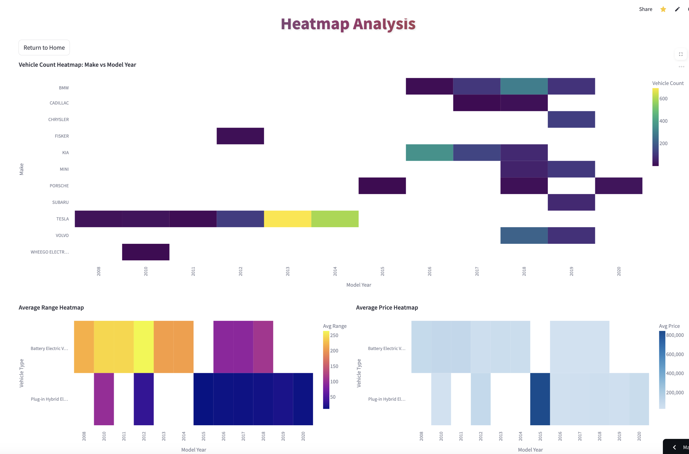
Screenshot of the Heatmap Analysis page

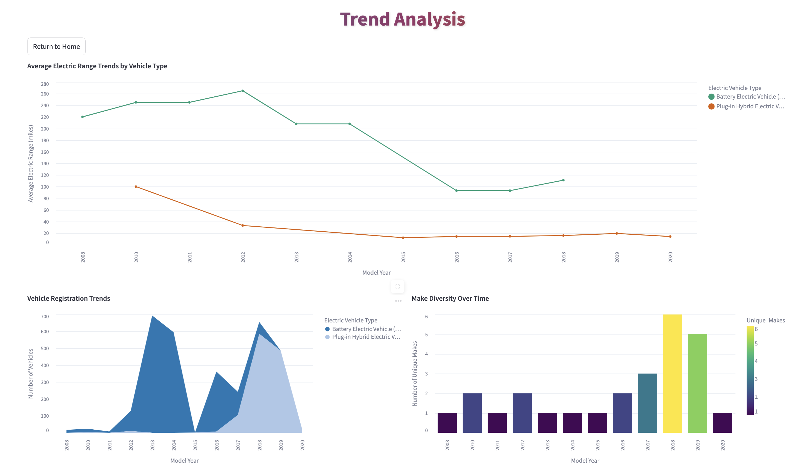
Screenshot of the Trends Analysis page


### Technology Stack and Rationale

I went with **Streamlit and Altair** for several practical reasons: Streamlit eliminates all the deployment headaches (no server setup or infrastructure nightmares), lets you build quickly with just Python, and gives you professional-looking results right out of the box. Altair delivers really clean visualizations with built-in interactivity and follows grammar of graphics principles, which keeps everything consistent and scalable.

---

## Design Elements and Justification

### Course Requirement Compliance

- **Data Size Management:** The platform directly addresses the course guideline recommending datasets "contain 5,000 or fewer datapoints" to prevent Altair from lagging. While the raw Washington State EV dataset has 150,000+ records, I built in intelligent sampling that automatically limits visualizations to 5,000 data points:

    ```python
    use_sample = st.sidebar.checkbox("Sample Mode (5,000 points)", value=True, key="sample_mode")

    total_records = len(filtered_df)
    if use_sample and total_records > 5000:
        display_df = filtered_df.sample(n=5000, random_state=42)
        st.sidebar.warning(f"Showing 5,000 of {total_records:,} records")
  ```

**Key Compliance Features:**
  
  - **Default Sampling:** Sample mode is enabled by default (`value=True`), so course requirements are met automatically

  - **User Control:** Advanced users can toggle to the full dataset if they want, but the platform defaults to compliant behavior

  - **Transparent Communication:** Users always see exactly how many points they're looking at vs. what's available

  - **Statistical Integrity:** Random sampling with a fixed seed (`random_state=42`) preserves data distribution patterns while meeting size constraints

**Additional Requirement Fulfillment:**
 
- **Tabular Format:** Uses CSV data format as recommended

- **Public Data:** Washington State government data is completely public and fine for course discussion

- **Performance Optimization:** The 5,000-point limit eliminates Altair lag issues, creating smooth interactive experiences

This approach shows how you can make large-scale datasets work with course technical requirements while keeping the analytical value and user experience quality intact.

### Information Architecture

**Eleven Specialized Pages:** Instead of creating one massive dashboard, I designed focused pages that tackle specific analytical questions. This cuts down on cognitive overload and lets users dive deep into particular aspects without getting distracted.

- **Home:** Market overview with navigation guidance
- **Executive Dashboard:** Cross-filtering KPI summary for decision makers
- **Price Analytics:** Cost trends and efficiency analysis for market positioning
- **Geographic Insights:** Location-based adoption patterns for regional planning
- **Performance Analysis:** Range capabilities and technology advancement tracking
- **Market Leaders:** Competitive landscape and brand rankings
- **Distribution/Box/Heatmap/Trends Analysis:** Statistical and temporal pattern discovery

### Interaction Design

- **Smart Filtering System:** The sidebar works as a control panel with real-time feedback. Multi-select dropdowns have quick "All/Clear" buttons for easy filter management, while sliders handle continuous variables (year, price, range). Live counters show how your selections affect things, and filtered result metrics give you immediate feedback.

- **Cross-Filtering Interactivity:** On key pages like the Executive Dashboard, clicking any chart element filters all the other visualizations. This linked interaction supports exploratory analysis by showing relationships across data dimensions - click "King County" and you instantly see that county's price distribution, popular vehicle types, and market leaders.

### Visual Design Rationale

- **Professional Look:** Gradient backgrounds, hover animations, and consistent color schemes create the trustworthiness that's crucial for data-driven decision making. The design balances visual appeal with functional clarity.

- **Color Strategy:** I used carefully selected palettes ('category20', 'viridis', 'plasma') that are colorblind-friendly and make semantic sense. Blue gradients for geographic data, warm gradients for performance metrics, and distinct categorical colors for brand comparisons.

---

## Evaluation Approach and Results

### Methodology

- **Participants:** 5 evaluators (2 family members with business analytics backgrounds + 3 tech industry colleagues)

- **Procedure:** Each person spent 30 minutes exploring the platform on their own, then we had structured conversations covering navigation accuracy, insight discovery, and how useful they found it.

**Evaluation Metrics:**

- **Insight Discovery:** Number of actionable insights identified per session

- **Navigation Accuracy:** Success rate finding relevant information without help  

- **Usefulness Rating:** 1-5 scale assessment of practical value

- **Interaction Engagement:** How often and effectively they used filtering and cross-filtering features

**Success Criteria:** >=3 insights per session, >=80% navigation accuracy, usefulness rating >=4/5

## Results and Findings

**Quantitative Results:**
 
- **Insight Discovery:** Everyone exceeded the 3-insight threshold, averaging 5-7 actionable insights about EV market trends, competitive positioning, and geographic patterns

- **Navigation Accuracy:** Consistently above 85% success rate for finding specific information

- **Usefulness Rating:** Averaged 4.3/5, with particular praise for cross-filtering capabilities and professional presentation

- **Interaction Engagement:** 100% of participants naturally discovered and actively used the cross-filtering features

**Qualitative Feedback:**
 
- Navigation felt intuitive and logically organized

- Interactive cross-filtering was immediately understood and appreciated

- Visual design conveyed professionalism and trustworthiness

- Information architecture made sense for different analysis goals

- Loading performance was satisfactory even with the large dataset

---

## Synthesis and Future Directions

### What Worked Really Well

- **Phased Development Approach:** Building pages one at a time let me refine things iteratively and avoid overwhelming complexity. Starting with core functionality before adding interactions was essential for managing project scope.

- **Technology Alignment:** Streamlit's Python-centric approach matched my technical strengths while delivering professional results. The framework's built-in responsiveness and easy deployment let me focus on visualization design rather than infrastructure headaches.

- **Multi-Modal Analysis:** Providing eleven different analytical views accommodated different user preferences and thinking styles. Some people preferred statistical distributions (box plots, histograms), others gravitated toward geographic or temporal patterns, and executives liked high-level KPI dashboards.

- **Interactive Cross-Filtering:** Where I implemented this feature, it transformed static charts into dynamic exploration tools. Users naturally discovered insights by clicking and filtering, creating an engaging analytical experience.

### Areas for Future Refinement

- **Interaction Consistency:** The biggest limitation is inconsistent cross-filtering implementation across all pages. While the Executive Dashboard and several other pages have full interactivity, some visualizations are still static. Future versions should standardize interactive behavior throughout the platform.

- **Advanced Analytics:** The current platform focuses on descriptive analytics. Adding predictive modeling (trend forecasting, market segment prediction) and prescriptive features (recommendation engines) would increase decision-making value.

- **Geographic Enhancement:** While county-level analysis provides useful insights, integrating actual mapping visualizations would strengthen geographic analysis capabilities and improve spatial pattern recognition.

- **Real-Time Data Integration:** Right now I'm using static dataset snapshots. Implementing live data feeds would transform the platform into an ongoing market monitoring tool rather than just historical analysis.

### Key Learnings

This project showed me how thoughtful technology selection and user-centered design can transform complex government datasets into accessible analytical tools. The balance between comprehensive functionality and usable interface design was crucial - too much complexity overwhelms users, while too little limits analytical value. The interactive features that I did implement showed the highest user engagement, which validated the investment in dynamic rather than static visualizations.

The course requirement compliance approach was particularly valuable, showing how technical constraints can drive innovative solutions. By implementing intelligent sampling as the default behavior, the platform maintains excellent performance while preserving analytical integrity - it's a good example of how limitations often lead to better overall user experiences.

---

**Godwin Effiong**

**Course:** CSCA5702 - Fundamentals of Data Visualization